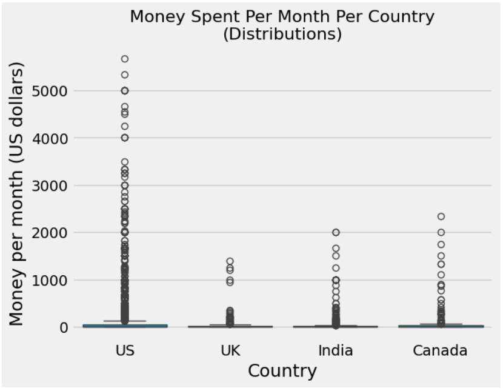

# Top Advertising Markets

In this guided project, we will be working with a dataset containing survey results. Throughout the project, we will combine statistical skills with practical analysis. By doing so, we hope to exemplify how beneficial these skills can be.

**Scenario:** We are working for a company that offers e-learning programming courses, along with a variety of other course topics. The company is looking to advertise its products.

**Goal:** To identify the top two markets for advertising the company's products.

View this project live on Google Colab [here](https://colab.research.google.com/drive/1kTSwMlphk5IKveZNMphr-pvzgdlRt5JU?usp=sharing).
